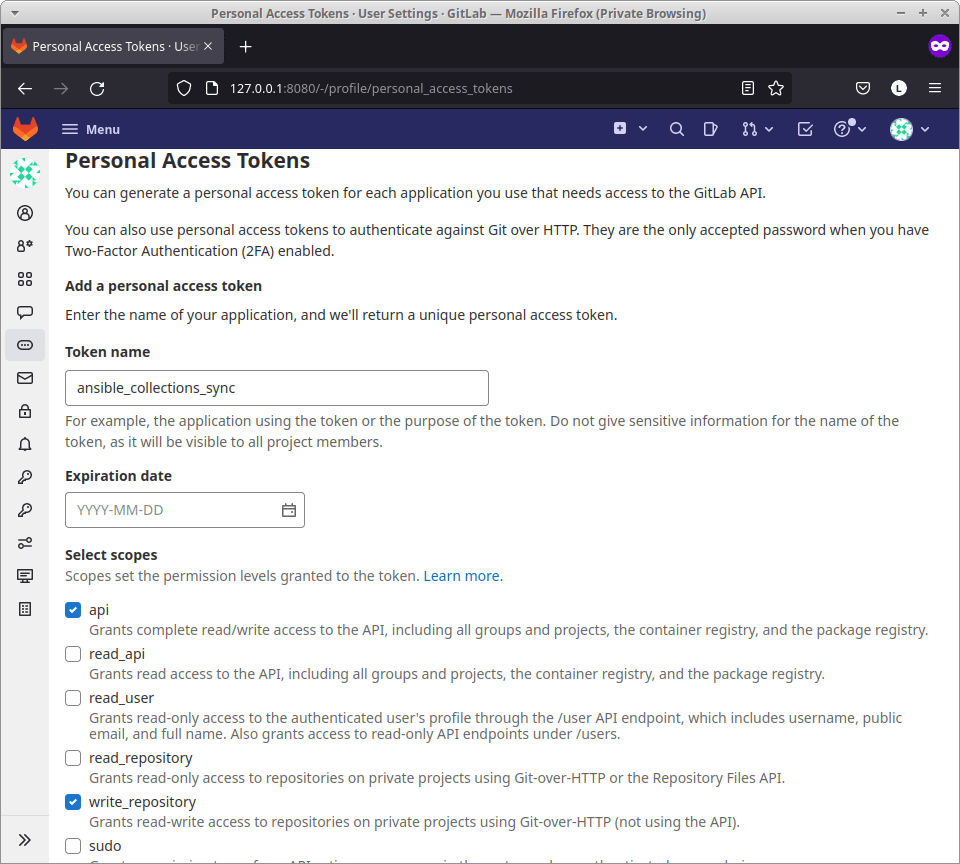
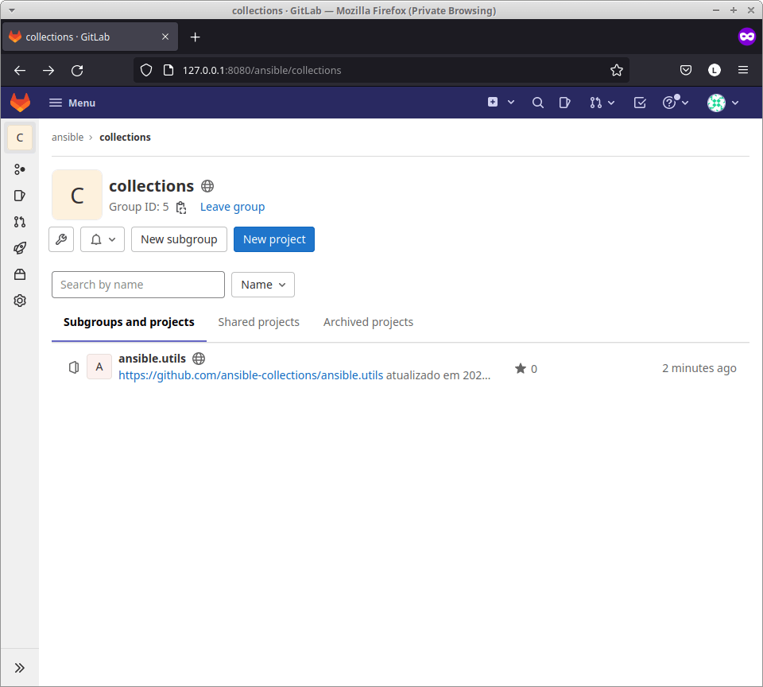
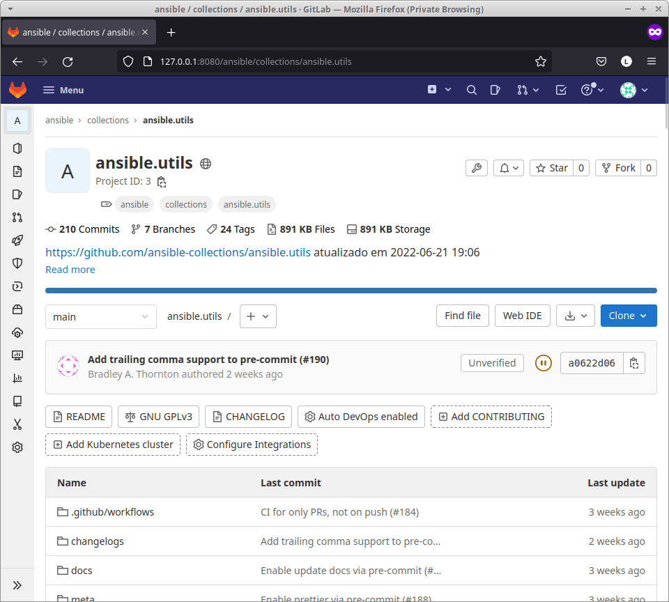

# galaxy light

Servidor para emular https://galaxy.ansible.com apontando para repositórios no gitlab.

# Configurações

No servidor onde será executado o `ansible-galaxy collection install`, definir `export ANSIBLE_GALAXY_SERVER=http://<galaxy-light host>:<galaxy-light port>`

# Variáveis de ambiente

| nome                           | default               |
|--------------------------------|-----------------------|
| GALAXY_LIGHT_GITLAB_ENDPOINT   | http://127.0.0.1:8080 |
| GALAXY_LIGHT_GITLAB_ROOT_GROUP | /ansible/collections  |
| GALAXY_LIGHT_TARGET_PATH       | /tmp                  |
| GALAXY_LIGHT_SERVER_BIND       | 127.0.0.1             |
| GALAXY_LIGHT_SERVER_PORT       | 8181                  |
| GALAXY_LIGHT_SERVER_PROTOCOL   | http                  |

# Laboratório

1. definir um grupo onde ficarão as collections: `ansible/collections`
> Caso não tenha uma instância do gitlab disponível, você pode [subir uma imagem docker](https://docs.gitlab.com/ee/install/docker.html).


2. gerar um token para interagir com o grupo recém criado



3. importar uma coleção para a sua instância do gitlab

```bash
export GITLAB_USERNAME=root
export GITLAB_TOKEN=zDy4WEJ1bxToj7kadrV-
export GITLAB_INSTANCE=http://127.0.0.1:8080
export GITLAB_COLLECTIONS_GROUP=ansible/collections
./import_collection_https.sh ansible.utils
```





4. iniciar o `galaxy-light`.
> `GALAXY_LIGHT_SERVER_BIND` é o IP da máquina host que será acessado pelo container rodando o ansible.

```bash
GALAXY_LIGHT_SERVER_BIND=192.168.10.100 \
GALAXY_LIGHT_SERVER_PORT=8181 \
GALAXY_LIGHT_GITLAB_ENDPOINT=http://192.168.10.100:8080 \
GALAXY_LIGHT_TARGET_PATH=/tmp/gl \
go run main.go
```

```text
         _                 _ _     _   _
 ___ ___| |___ _ _ _ _ ___| |_|___| |_| |_
| . | .'| | .'|_'_| | |___| | | . |   |  _|
|_  |__,|_|__,|_,_|_  |   |_|_|_  |_|_|_|
|___|             |___|       |___|

Listening: 192.168.10.100:8181
```

5. iniciar um container python e fazer a instalação do ansible

```bash
docker run -it \
           --rm \
           --entrypoint /bin/bash \
           -e "ANSIBLE_GALAXY_SERVER=http://192.168.10.100:8181" \
           python

root@82f20c447396:/ pip install ansible
...
Installing collected packages: resolvelib, PyYAML, pyparsing, pycparser, MarkupSafe, packaging, jinja2, cffi, cryptography, ansible-core, ansible
Successfully installed MarkupSafe-2.1.1 PyYAML-6.0 ansible-6.0.0 ansible-core-2.13.1 cffi-1.15.0 cryptography-37.0.3 jinja2-3.1.2 packaging-21.3 pycparser-2.21 pyparsing-3.0.9 resolvelib-0.8.1
```

6. testar a instalação da collection

```bash
root@82f20c447396:/ ansible-galaxy collection install ansible.utils
Starting galaxy collection install process
Process install dependency map
Starting collection install process
Downloading http://192.168.10.100:8181/dl/ansible.utils-2.6.1.tar.gz to /root/.ansible/tmp/ansible-local-197wplrhk1/tmpox40ih7g/ansible.utils-2.6.1-14vly8ns
Installing 'ansible.utils:2.6.1' to '/root/.ansible/collections/ansible_collections/ansible/utils'
ansible.utils:2.6.1 was installed successfully
```
